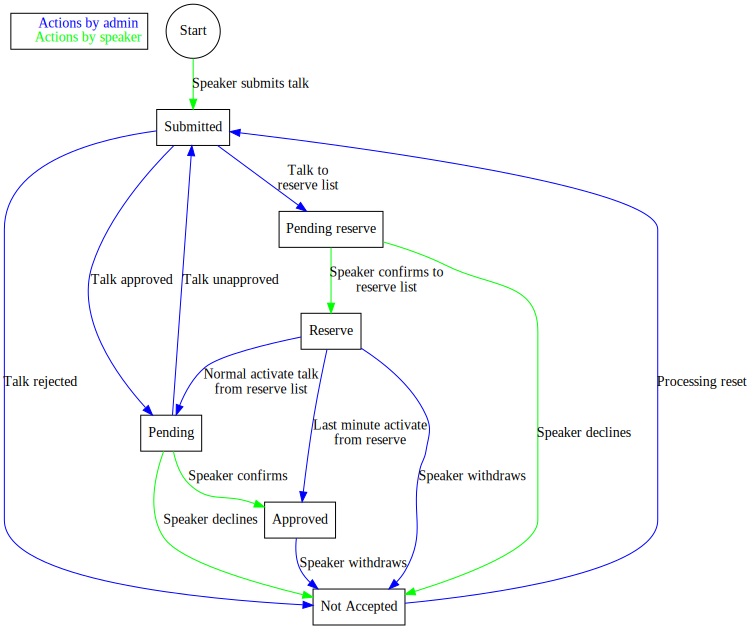

# Call for Papers

## Running a call for papers

Running a call for papers consists of a few clearly separated steps:

### 1. Collecting proposals

To start collecting proposals, enable the call for papers on the
[conference](configuring). As soon as this is done, speakers can start
submitting entries. Before doing that, make sure you configure the
introductory text (if you want one), and decide if you want to ask for
skill levels.

If you want to ask for Tracks in the call for papers, make sure you
[create them](schedule#tracks) first, and flag them as "in call for
papers". If no tracks with "in call for papers" set exists, the track
field will automatically be excluded from the call for papers form.

Each speaker has to set up a speaker profile. This profile is shared
between all the conferences on the system, so if they have already set
one up, then they can just re-use the one they already have.

### 2. Voting

Voting is done by everybody who is listed as a talk voter in the
conference configuration, by using the "view sessions and vote" page.

Each person can give a score, 1-9 with 9 being the best, to a talk to
rate it. If the score is left at 0 that means "no vote", it does *not*
mean "really bad".

Normally each person is not allowed to vote for any talks they
submitted themselves, and need to exercise restraint when voting for
colleagues. However, those rules are not in any way enforced in the
system, but are handled manually by the people on the committee.

Each voter can leave a comment for each talk in the text field, and
view each others comments. All voting is open to all members of the
committee.

Click the talk title to view full details about the talk.

Click the status to bring up a dialog allowing the change of status.

Sessions can be sorted by session name (default), speakers or average
score by clicking the appropriate headlines.

### 3. Deciding and notifying speakers

Once the voting is done, the decisions can be made and the speakers be
notified. As this process starts, each session pass through a number
of [states](#states), where each level can generate an email. These
emails are always just flagged and not sent until explicitly
requested. That way it's possible to perform extra review.

A state of a session can be changed either from the voting page (by
clicking the current state and picking a new one) or from the Edit
Session page (by picking a new state in the drop down). In either case
the new state is limited by valid state transitions. By repeating this
process it is possible to "break the rules" and bypass states, but
this should of course never be done. After having edited a session
state, be sure not to forget to trigger the emails!

Once a session has entered the *approved* state, it will show up in
the list of sessions, if that is enabled for the
[conference](configuring).

See below for a diagram of how a session moves through the different
states. Most of these steps are fully automatic by changing the
state. The *exception* to consider here is the **reserve list**!

To put a session on the reserve list, the process is:

1. Contact the speaker manually via email to confirm that they are
willing to be on the reserve list, knowing what it means.
1. Change the state to Reserve
1. Trigger the email

## Session states 

During call for paper handling, a session moves between different
states. Some of these movements are initiated by the user (such as
submitting or confirming a talk), some are initiated by the admin
using the backend interfaces.

Whenever a session state is changed, an email may be triggered. These
emails are *not* sent by default. Instead, they are placed in a queue,
and this queue can be reviewed and emptied using the button that
appears on the main administration page when the queue has some
contents. This is so that it can be verified that incorrect state
change emails are not sent out in the middle of processing multiple
talks as part of a call for papers.

### Session state flow

## Slides 

The call for papers system has a built-in functionality to handle
uploading of slides from speakers, or linking to them.

Once a talk is in the [state](#states) *Accepted* it will be possible
for the speaker to return to the page for it and either upload slides
or add links to slides that are hosted elsewhere (such as on their
personal website or on a slide-hosting service). Once uploaded these
slides will be available from the public page of the session, and
possibly also indicated in the session list and on the schedule
(depending on the templates used).

Uploaded slides are restricted to PDF format.
