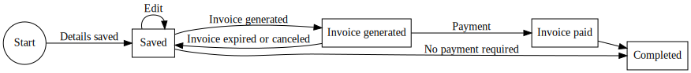

# Registrations and registration types

## Registrations

### Regular registrations

Registrations are at the core of the system. The standard workflow is
intended to be as simple as possible for the attendee (whether it
succeeds can always be discussed..):

1. The attendee signs in to the registration form. This step requires
   a community account, or one can be created as part of the signup
   process.
1. The exact fields to be filled out can be
   [configured](configuring) at the conference level, for
   example if there should be a field about t-shirt size or not.
1. The attendee can incrementally fill out and save in between if
   necessary. If they do that, they will at regular intervals receive
   a reminder email from the system telling them they have a stalled
   registration.
1. Once ready, they click "Save and Finish". At this point they get a
   chance to review their charges, and then proceed to actually
   generate an invoice.
1. Once the invoice is generated, the registration data is
   locked. This invoice can then be paid by any of the configured
   payment methods, normally by credit card or PayPal. If the invoice
   is not paid within the defined [autocancel](configuring) period,
   the invoice is automatically canceled, and the registration is
   returned to unlocked state, and will again start receiving
   reminders to complete it.
1. Once the invoice is paid, a receipt is sent to the user. If a
   welcome email is [configured](configuring) for the conference, this
   email will be sent to the user.
1. Certain fields are unlocked for editing again, until the *allow
   editing* checkbox is [turned off](configuring). The registration is
   now fully complete.

### Multiple registrations

The system also supports a method for registering multiple attendees
from the same account. This can also be used for one person to make a
registration for somebody else, the process is the same.

1. The person making the registrations proceeds to the form for
   registering for somebody else or advanced registration.
1. For each of the attendees that should be registered, the email
   address is added and then the registration details are filled out
   for that attendee. Additional options can be added if necessary, as
   well as [voucher and discount codes](vouchers). The same fields and
   restrictions as regular registrations are used.
1. Once all registrations have been made, the user picks *Create
   invoice*. At this point an invoice is created for all registrations
   that are pending under this user. This invoice is paid using the
   same rules as all other invoices.
1. Once this invoice is paid, all registrations are confirmed at the
   same time. Each attendee receives the confirmation email.
    * If a community account exists for a user registered this way,
      this account is automatically connected by matching the email
      address, and this user can access their registration page as
      normal.
    * If no account exists, the user is sent an email with a
      token-link that allows them to connect it to a different
      community account, regardless of email address matching. The
      attendee can also create a new account at this point.

The system for multiple payments is automatically disabled once the
[waitlist](waitlist) is in force.

### Bulk payments

Bulk payments is mostly the legacy way for handling multiple
registrations, and is not used much anymore. The reason for this is
that it requires a somewhat awkward interaction between the users
registering and the person paying. The steps are:

1. Each user makes their own registration, completing step 1-3 in the
   list above. It is, however, very important that they do not proceed
   to step 4 (this is the first part that usually fails).
1. The person paying the bill then goes into the bulk payment
   interface, and adds each individual registration using the email
   address (this is the second part that usually fails), and enters
   the invoicing details.
1. The invoice is paid.
1. The person who set up the invoice receives the receipt, and each
   individual attendee receives the registration confirmation.

The system for bulk payments is automatically disabled once the
[waitlist](waitlist) is in force.

## Registration types and classes 

When making a registration, the attendee picks the appropriate
[registration type](#regtypes). There always has to be at least one registration
type, even for the most simple conference.

A registration type contains the different kinds of parameters that are per-type
configuration and maps those to what the user picks. This include things like
cost, ability to pick [options](#options) and so on. Typical examples
of this is "Normal attendee", "Speaker", "Staff" etc.

An *optional* object higher up in the hierarchy is a registration
class. A registration class groups a number of registration types
together as one group. A typical example of this is there may be both
"Attendee" and "Training attendee" as registration type, which both
map to "Attendee" as registration class. In this scenario, the badge
rendering (primarily - but other templates as well) can reference the
registration class to for example always use the same color on the
badge and similar things.

### Special registration types

A registration type can be mapped to a *special registration
type*. This sets a number of restrictions on how a registration can be
used. The following types are currently available:

Manually confirmed
: If this is picked, the registration cannot be completed by the
attendee. It requires the administrator to confirm it manually.

Confirmed speaker
: The attendee registering must, with the same community account, have
a speaker profile, and have at least one talk by this speaker profile
be in a [state](callforpapers#states) of *Accepted*. Most of the time,
the "Confirmed or reserve speaker" should probably be used instead.

Confirmed or reserve speaker
: The attendee registering must, with the same community account, have
a speaker profile, and have at least one talk by this speaker profile
be in a [state](callforpapers#states) of *Accepted* or the state
*Reserve*.. This means that speakers on the reserve list can also use
this registration type, which is usually the choice wanted since they
should be able to be substituted at the last moment.

Confirmed staff
: The attendee registering must use one of the community accounts that
are listed as staff in the [conference configuration](configuring).

### Registration days 

Registration days are not a mandatory part of the system, but if they are used
they are used to indicate which different days the conference runs, and can be
used to limit certain registration types to certain days, typically used to
render information on the badges.

IN the system, registration days are simply a list of dates, that must fall
between the [conference](configuring) start date and end date.

## Additional options 

Additional options represent things that can be added to a
registration, such as training sessions, attendance to a separate
event etc. An additional option can either be paid for, or it can be a
free option. It is something that is normally done at registration
time, and should not be confused with [signups](signups) which are
normally used to handle things like signing up for a social event or a
dinner or similar things.

An additional option can be restricted so it can only be used by
a set of specific registration types. This is typically used to handle
things like certain discounted registration types should not get
access to a specific additional option.

The reverse is also possible, a registration type can be configured so
that it *requires* a specific additional option. This way is typically
used to ensure things like training discount registration only being
available to attendees who actually purchase training.

Each additional option can be associated with a
[cost](#additionaloptions), in which case the cost
of it will be added to the initial invoice. It will also handle the
case when the attendee later adds an option to a registration, and
will generate an invoice before the transaction is completed.

## Transferring a registration 

A registration can be transferred to a different person, typically
only allowed within the same company. If this transfer should be
associated with a cost, the payment for it has to be processed
manually.

To perform a registration transfer:

1. Ensure the *new* person attending makes a registration in the
   system, but does *not* generate an invoice. If the
   [waitlist](waitlist) is active, the registration should also *not*
   be signed up on the waitlist (if it is, it has to be canceled
   first).
2. Go to the transfer page, and pick the registrations to transfer to
   and from.
3. Validate the steps shown, and confirm the transfer.

When transferring a registration, both the "source" and "destination"
attendees will receive an email telling them about the transfer once
it has been completed. An email is also sent to the conference
organiser address.

Existing invoices are re-attached to the new registrations, so after a
transfer there will be a mismatch between what's on the invoice and
what's in the registration, but they are both traceable to each other.

## Reference

### Registration types 

Regtype
: Name of the registration type as shown to the user

Regclass
: Registration class that this registration belongs to. This can be left
unspecified, but that is likely to cause issues with things like badge generation.

Cost
: The cost for registering with this type, if any. 0 if the registration is free. If
VAT is used, the cost is specified without VAT.

Active
: Whether this registration class can be used at this point.

Activeuntil
: The use-before-date for this registration type. If left empty, the registration type
can be used as long as it's active and registration is open.

Days
: References which days this registration type gives access to, if registration days are
used at this conference.

Sortkey
: An integer specifying how this registration type should be sorted. Lower numbers are
sorted first.

Specialtype
: If this registration type has special rules on it

Require phone
: If attendees registering with this registration type should be required to enter
their phone number (typically for speakers and/or staff)

Alertmessage
: This message is shown in a pop-up window when the user tries to complete the
registration. This is typically used for things like informing people of special
requirements such as a student ID to access student discounts.

Autocancel invoices
: If registrations with this registration type should override the value for
autocancel from the [conference](configuring). The lowest value of
autocancel is always used.

Requires option
: If a specific [additional option](#options) is required to use this
registration type. If multiple options are chosen, *any one* of those
will be enough to allow the registration type.

Upsell target
: If it should be possible t upgrade to this registration type in
order to add additional options. If this type is more expensive than
the previous one the attendee has, the difference will be invoiced.

### Registration classes 

Registration class
: Name of the registration class

Badge color
: Background color used on badge for this registration class (assuming
the template makes use of this).

Badge foreground
: Foreground color used on the badge for this registration class
(assuming the template makes use of this).

### Additional Options 

Name
: Name of the additional option

Cost
: Cost of this option, if any. If VAT is used, the cost is specified
without VAT.

Maxcount
: Maximum number of instances of this additional option that can be
purchased in total.

Public
: If this option is available on the public registration form. If this
box is not checked ,the option can only be added by administrators.

Upsellable
: If this option can be added to a registration after it has been
completed.

Autocancel invoices
: If registrations with this option should override the value for
autocancel from the [conference](configuring). The lowest value of
autocancel is always used.

Requires regtype
: In order to add one of these options, one of the specified
registration types must be picked. If the attendee does not have one
of these registration types, they may be offered an upsell to a
different registration type if that is [enabled](#regtypes).

Mutually exclusive
: This option cannot be picked at the same time as the selected other
options. This is typically used for things like training sessions
running at the same time. If the exclusion is specified in one
direction between the two options, it is automatically excluding both
directions.
