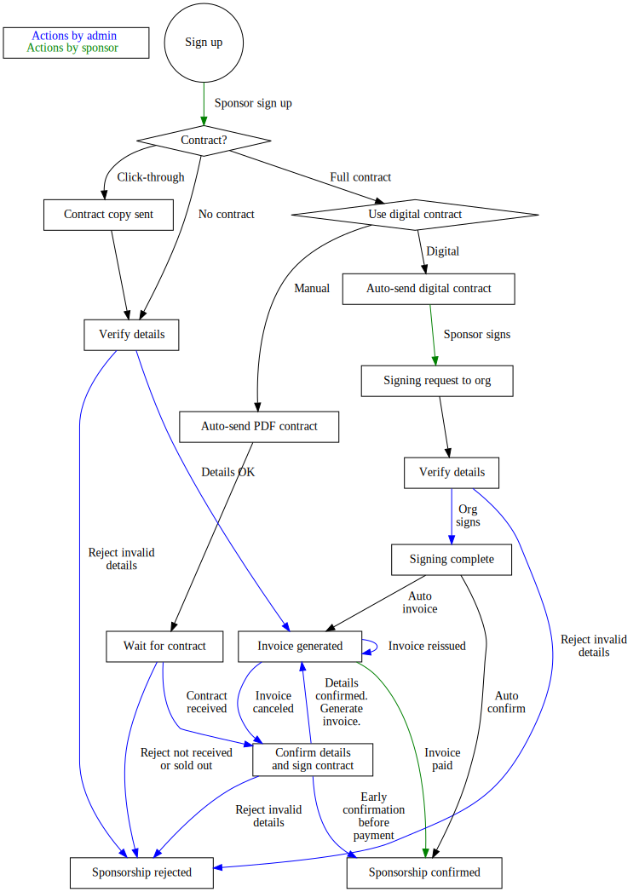

# Sponsors and sponsorship

### Terms

Sponsorship level
: This corresponds to a specific level of sponsorship such as *Gold*
  or *Silver*

Sponsorship contract
: This represents an uploaded PDF with the terms and conditions for a
  sponsorship level. This can be different between different levels
  for the same conference to make each one shorter, but is typically
  the same.

Sponsorship benefit
:  One sponsorship level can have multiple sponsorship benefits, each
   being something the user sponsor "gets", such as free entry passes
   or logo on website.

Sponsorship benefit class
:  A sponsorship benefit belongs to a class. This defines only how they
   are handled in the system. For example, a specific class handles
   image uploads, and another class handles "click a button".

Claiming a benefit
:  A sponsor *claims* a benefit to indicate they want it. If this is a
   "checkbox claim" then that's all they do. A claim can also require
   input from the sponsor, such as an uploaded image or a specified
   text. What is required or not is controlled by the benefit class.

Declining a benefit
:  By declining a benefit a sponsor can explicitly indicate they do
   not want the benefit.

## Setting up for a conference

To set up sponsorship for a conference, in order:

1. Upload a [sponsorship contract](#contract). Normally just one is
   needed, but if different ones are used then upload them separately.
1. Create one or more [sponsorship levels](#level).
1. Open sponsorship on [the conference](configuring).

Note that the *benefits* should **never** be changed after sponsors
have started to sign up, but there is nothing in the system actually
preventing it (things like fixing spelling and wording is of course
always allowed...)

## Sign-up process

The sign-up process looks slightly different depending on if the
sponsorship level picked requires a signed contract or not.

In particular, the workflow is 100% automated for sponsors that have
instant signup, and there is nothing that should be done by
administrators other than to click through the approval of the
sponsorship details.

In manual sponsors, the order of processing for the administrators
once the signup is complete becomes:

1. Wait for the signed contract. Counstersign and send back.
1. Generate an invoice by going to the sponsorship and click the
   button for it.
1. Optionally, also confirm the sponsorship, unless this is from a
   sponsor known to not pay on time etc. For trusted sponsors, it's
   normal to trust the signed contract and let them proceed, but
   make sure to double check things like invoice details before doing
   so, as reverting from this state is complicated.

## Sponsor waitlist

The sponsor waitlist is managed manually. When a maximum number of
sponsors are set at a level, signup works normally until there are
that many sponsors signed up.

Once that number of sponsors are signed up *and confirmed*, the
sign-up button is automatically removed, and the level cannot be used
anymore.

In the period where there are fewer *confirmed* sponsors than there
are maximum number of allowed sponsors, a wait list is allowed. The
waitlist is *manually* managed, so what happens is that these sponsors
are added as normal, but should not be "clicked through" by the
adminstrator. Once the limit is exceeded a red warning text is shown
on the page where invoices are generated, to avoid doing this by
mistake.

## Managing sponsors

Once sponsors are confirmed, await them to claim sponsorship
benefits. As soon as benefits are claimed an email is sent to the
sponsor handling address, and administrators are expected to either
confirm or unclaim those benefits "reasonably quickly".

## Benefit classes 

The following benefit classes are available:

Require uploaded image
:  This benefit class requires an uploaded image in a specific format
   (typically PNG) and with the configured size and transparency
   settings.

Requires explicit claiming
:  This benefit class requires the sponsor to explicitly claim, but does not
   require any extra information.

Claim entry vouchers
:  This benefit class gives the sponsor the ability to order free attendee
   vouchers of a specified registration type. They do not guarantee
   seats (so they may end up on the waitlist), and they are only
   usable as payment for the entry itself, not for any additional
   options.

Provide text string
:  This benefit class requires the sponsor to submit a specific text,
   within the set minimum and maximum number of words or characters.
   Set either limit to 0 to allow any number.

List of attendee email addresses
:  This benefit class allows the sponsor to download a list of attendee
   email addresses (only those that opted in to sharing) after the
   conference has finished.

## Reference

### Sponsorship 

### Sponsorship level 

Level name
:  Name of the sponsorship level (shown to the user)

URL name
:  Name-part used in URLs for this sponsorship level (typically a
   slug-style lowercase version of the name)

Cost
:  Price for this level (excluding VAT if VAT is used)

Available for signup
:  Whether this level is currently enabled for signup.

Maximum number of sponsors
:  Maximum number of sponsors that can sign up at this level. If more
   than this number of *confirmed* sponsors exist, the sign up button
   will be removed. If there are fewer *confirmed* sponsors, but the
   total number including *unconfirmed* sponsors exceed exceed the number,
   sponsors are offered a waitlist. If set to zero then an unlimited
   number of sponsors are allowed at this level.

Instant buy available
:  If this level requires a signed contract. If this box is checked,
   then the sponsor can do a "click-through" accepting of the contract
   and proceed directly to confirmation and invoice, with no explicit
   contract signing required. If it is not checked, then the
   administrator must manually move the sponsorship forward in the
   process once a signed contract is received.

Payment methods for generated invoices
:  Which payment methods will be listed on the generated
   invoices. Typically the instant buy levels support payment by
   creditcard, but higher levels may only support manual bank
   transfers.

Can buy vouchers
:  Can sponsors at this level buy extra vouchers that they can give to
   employees, customers or others. These vouchers are separate from
   the free vouchers given, and are paid for independently.

Can buy discount codes
:  Can sponsors at this level buy discount codes, which can provide
   either a fixed or percent discount. These discount codes will be
   separately invoiced to the sponsor once they have closed (and it's
   known how much cost they generated).

Benefits
:  A list of [benefits](#benefit) available at this level. New
   benefits can be added with the *Add benefit* button.

### Sponsorship benefit 

Benefit name
:  Name of the benefit as shown to the sponsor.

Benefit description
:  Free-text description of the benefit as shown to the sponsor.

Sort key
:  Integer indicating the sort order for this benefit, with lower
   numbers sorting first in the list.

Claim prompt
:  A n optional popup prompt that will be shown to the user when
   claiming the benefit.

Tweet template
:  A template, in jinja2 format, used to generate tweets when this
benefit is confirmed. If left empty, no tweet is posted. Can reference
*sponsor*, *level*, *conference* and *benefit* variables that will be
filled with information about the current conference.

Parameters
:  [Benefit class](#classes) specific parameters for this benefit.

### Sponsorship contract 

Contract name
:  Give the contract a name. This is what will be used in selection
   dialogs elsewhere. It will also be used as the name of the PDF when
   sent to end-users.

Contract PDF
:  Upload a PDF with the contract. Take at least some level of care to
   with the size of it. There is no limit enforced by the system other
   than what is configured on the webserver as maximum request size.
