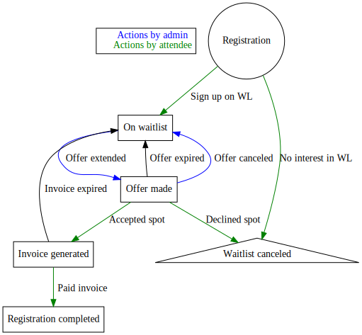

# Waitlist management

The waitlist is enabled automatically when the number of *confirmed*
attendees to the conference exceeds the number of attendees
[configured](configuring) for it. There is no way to manually enable
the waitlist, other than to reduce the number of attendees before
waitlist to a number below the current amount.

Once this is hit, every attendee who wants to sign up will be offered to
sign up on the waitlist. If they want to do that, they will be added
to the waitlist with an empty status, and an email is sent to the
administrators.

One or more attendees can be given an *offer* from the waitlist. This
offer is given an expiry time, giving the chance to sign up before
that time. The expiry time can either be given as number of hours from
the current time or as an explicit point in time, depending on which
field/button combination is used. The length of the offer is usually
adapted to how much time is left until the conference -- to make sure
that if the attendee doesn't take the offer, there is enough time to
give it to somebody else. The system does *not* take things like
office hours into account when calculating the offer time, that has to
be done manually (and usually using the make offer until specific
point in time button).

Offers should always be given from the top of the waitlist. This will
make sure that those who signed up early gets a chance first. The
exception to this may be when different types of registrations can
have different limits -- for example, a training attendee might get
priority.

When the offer is extended to a attendee, they will be sent an email and
can complete the registration. If they complete it, they become a
registered attendee like any other with no difference. If they decline
it, or if the timer expires, their registration is returned back to
the waitlist. If this happens it will go back to the *bottom* of the
waitlist, and any other attendees on the waitlist will get another
chance.

The values at the top of the waitlist dashboard that are most useful
when managing the waitlist are:

Pending registrations with (invoice/bulk payment)
: Number of attendees that are far enough into the process to have an
invoice or a bulk (multi-registration) payment generated. These can
usually be expected to complete their payments and take their spot.

Active offers on the waitlist
: Number of attendees that have been given an offer, but have not
completed it yet. This includes both those that have generated an
invoice and those that have not.

Total registrations including offered and invoiced
: If all active offers are taken and completed, this is the number of
attendees it will result in. This is typically the number to work off
-- as long as this number is lower than the venue capacity, more
offers can be given.

## Waitlist workflow

## Waitlist emails 

It is also possible to send email to all attendees on the
waitlist. This can be filtered to be all on waitlist, or just the ones
with or without offers.

Unlike [attendee emails](emails) these are sent directly but are not
archived on the registration pages or similar, as these are to
accounts that have not yet got a registration.

If wanted, the position on the waitlist and/or the size of the
waitlist can be included. If this is selected, a sentence about it
will be added as a footer of the email.
